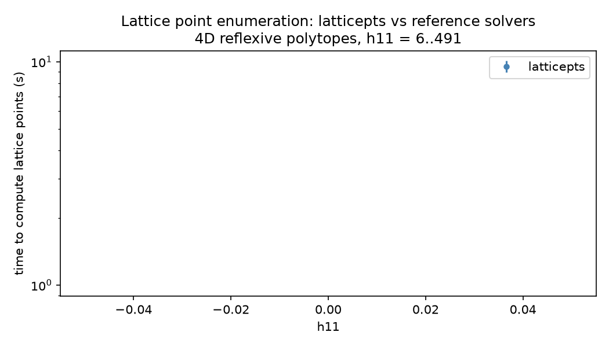
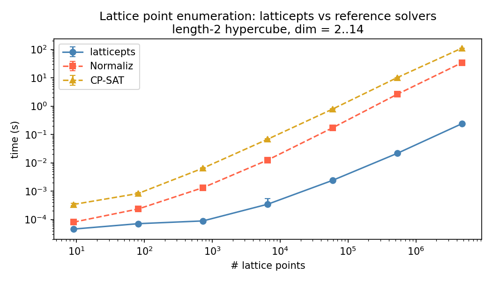
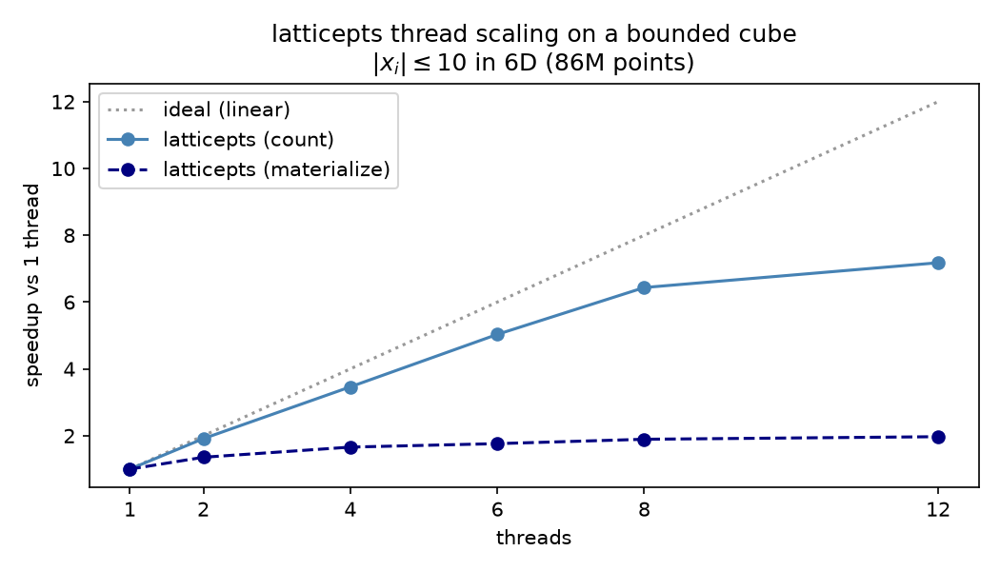

# latticepts
*[Nate MacFadden](https://github.com/natemacfadden), Liam McAllister Group, Cornell*

[](https://doi.org/10.5281/zenodo.19405318)

Fast lattice point enumeration for convex polyhedra. A C/Cython implementation of Kannan's algorithm, significantly outperforming Normaliz and OR-Tools CP-SAT in speed for certain problems. To demonstrate the performance, `latticepts` materializes ~108M lattice points in the strict interior of an example 7D cone (['Manwe'](https://arxiv.org/abs/2406.13751)) in ~15s single-threaded, or ~7.7s on 12 threads on an Intel Core i5-10600K (4.1 GHz, 16 GB RAM, Ubuntu 24.04). We can also just count points, which is quicker.

**Used by** [CYTools](https://cy.tools/) and [Macaulay2](https://macaulay2.com/) (see [here](https://github.com/Macaulay2/M2/blob/c2aa530f2c1de5e3eb76c2dc8e7663b03697b179/M2/Macaulay2/e/cytools/README.md?plain=1#L12)).

## Description

More explicitly, `latticepts` enumerates lattice points

$$ \\{x\in\mathbb{Z}^{\text{dim}}: Hx\geq\text{rhs}\\} $$

for $H\in\mathbb{Z}^{N_\text{hyps}\times\text{dim}}$ and $\text{rhs}\in\mathbb{Z}^{N_\text{hyps}}$. Here each row of $H$ is an inward-facing facet normal and the corresponding entry of $\text{rhs}$ is its offset. Cones correspond to $\text{rhs}=0$; 'stretched cones' (e.g., for finding strict interior points) correspond to $\text{rhs} > 0$; polyhedra to general $\text{rhs}$.

`latticepts` *materializes* the lattice points (lists them). The exposed `count_only` mode is there primarily to **size that allocation** -- it runs the search and reports how many output points there are (the matrix size to allocate) without itself allocating the (multi-GB) output array. Getting a count is incidental; for counting alone, [LattE](https://www.math.ucdavis.edu/~latte/) is likely faster. For *generating* the points, the closer competing approach is to compute/use a Hilbert basis.

## Limitations

- Maximum dimension: 256. For convex cones, `latticepts` excels at low-dimensions. It can become sluggish in comparison to alternatives at higher-dimensions (well before 256)
- Windows is not supported: the C kernel uses C99 variable-length arrays, which MSVC does not support

## Installation

```
pip install -e .
```

Requires a C compiler.

For a faster, machine-specific build from source, set `LATTICEPTS_NATIVE=1`:

```
LATTICEPTS_NATIVE=1 pip install -e .
```

Enumeration runs in parallel over the independent top-level search branches -- both counting and materializing. Opt in with `LATTICEPTS_OPENMP=1` (needs an OpenMP-capable compiler -- standard on most Linux machines, not on most Macs):

```
LATTICEPTS_OPENMP=1 pip install -e .
```

then set the thread count at runtime via the `OMP_NUM_THREADS` environment variable:

```
OMP_NUM_THREADS=8 python your_script.py
```

The two build flags are independent and compose; for the fastest build, set both:

```
LATTICEPTS_NATIVE=1 LATTICEPTS_OPENMP=1 pip install -e .
```

Counting parallelizes well -- ~6x on 12 threads when there are many top-level branches (latticepts splits the search across the top coordinate's values, so that count caps the speedup); materializing gains less (~2x: its two-pass count-then-fill is more memory-bound), and the thread-startup overhead can make the serial path (`parallel=False`) faster for small outputs. No extra memory either way: counting holds only each thread's small `O(N_hyps * dim)` search state, and materializing fills disjoint slices of the single output buffer (no per-thread copies). See [the benchmarks](#benchmarks) for thread-scaling plots.

## Algorithm Notes

This repo contains a Cython wrapper of a C implementation of [Kannan's algorithm](https://doi.org/10.1287/moor.12.3.415). See [this webpage](https://cseweb.ucsd.edu/~daniele/Lattice/Enum.html) for some other relevant work (not by me). The specific implementation in this repo is for lattice point enumeration in square boxes $|x_i|\leq B$ for $B\geq 1$. I.e.,

$$ \\{x\in\mathbb{Z}^{\text{dim}}: Hx\geq\text{rhs} \text{ and } |x|_\infty \leq B\\}. $$

It is a [short, single-file implementation](https://github.com/natemacfadden/latticepts/blob/main/latticepts/box_enum.h): one self-contained, dependency-free C header (`box_enum.h`, ~290 lines of code, depending only on standard C libraries... no extra install) - I encourage you to read it. The single-file format was inspired by the [stb-style](https://github.com/nothings/stb). If Python is easier to follow, [`reference/kannan_reference.py`](https://github.com/natemacfadden/latticepts/blob/main/reference/kannan_reference.py) is a pedagogical `numba.njit` port of the same algorithm. The Python port is efficient but has less options than `box_enum` (scalar `rhs` only, so cones and stretched cones but not general polyhedra) and is not used at runtime.

A helper method to `box_enum` is provided in case the user wants $N$ points but doesn't care about box size. One such task here is for enumerating some lattice points in convex cones. In this case, boxes of increasing sizes $B$ are studied until $\geq N$ lattice points are found.

## Benchmarks

The three comparison benchmarks below are **single-threaded** -- each tool is given one thread, so none is helped or hurt by its own parallelism -- measured on a 6-core / 12-thread Intel Core i5-10600K (4.1 GHz, 16 GB RAM, Ubuntu 24.04) with the default `pip install` build (GCC `-O3`). Each plotted point is the median of several warmed-up runs; error bars are usually smaller than the marker. To recreate: `conda env create -f environment-bench.yml`, then run the [`benchmarks/`](https://github.com/natemacfadden/latticepts/tree/main/benchmarks) scripts. latticepts's own multicore scaling is shown separately below.

**Convex cones:** runtime vs requested number of interior lattice points in a cone (i.e., not on the boundary). The cone studied is the 7D 'Manwe' from https://arxiv.org/abs/2406.13751:

<p align="center">
  
</p>

**Polytopes:** runtime to enumerate all contained lattice points for various 4D reflexive polytopes. Size of the polytope is measured by h11 with one polytope per h11 value, h11 = 6..491:

<p align="center">
  
</p>

**More polytopes:** runtime vs dimension of length-2 hypercubes $[0,2]^{dim}$ for dim = 2..14:

<p align="center">
  
</p>

**Thread scaling:** latticepts also parallelizes (build with `LATTICEPTS_OPENMP=1`; the comparison plots above use the single-threaded serial path). It splits the search across the top coordinate's values, so the number of top-level branches caps the speedup. On a bounded cube $|x_i|\leq 10$ in 6D (~86M points, 21 top-level branches), the parallelization achieves ~6x speedup for counting the points and ~2x speedup for materializing them, both on 12 threads. Parallelization was often counterproductive (slower) for Normaliz and CP-SAT.

<p align="center">
  
</p>

## Usage

There are two primary interfaces. For unbounded polyhedra (e.g., cones), the focus is on efficiently generating a finite collection of lattice points. This can be done via `enum_lattice_points` which enumerates all lattice points with components bounded by $|x_i|\leq B$ in the polyhedron. The algorithm increases the size of $B$ until a user-requested number of points is found. See the following example of how to use this to get lattice points in the strict (since $rhs=1$) interior of a convex cone:

```python
import numpy as np
from latticepts import enum_lattice_points

# Find at least 1000 lattice points in {x : H @ x >= rhs}
H   = np.array([[1, 2], [3, -1]], dtype=np.int32)
rhs = 1
pts = enum_lattice_points(H=H, rhs=rhs, min_N_pts=1000)

# Optionally restrict to primitive vectors (GCD = 1)
pts = enum_lattice_points(H=H, rhs=rhs, min_N_pts=1000, primitive=True)
```

`box_enum` allows direct control over the box size $B$ instead of the number of lattice points. I.e., to enumerate all lattice points in $\\{x: Hx \geq \text{rhs},\\ |x|_\infty \leq B\\}$:

```python
from latticepts import box_enum

pts, status, N_nodes = box_enum(B=5, H=H, rhs=rhs, max_N_out=10_000)
# status: 0 = success, -1 = dim>256, -2 = hit max_N_out, -3 = hit max_N_nodes, -4 = too many constraints
# (statuses are also explained in the docstring)
```

`box_enum` is well suited to lattice point enumeration in polytopes (assuming an H-representation is known). For example, if one knows a bounding box of the polytope (if you have a V-representation, this is trivial: $B = \max|v_i|$ over all vertices), then the lattice point enumeration can be done as follows. Here's an example of the $h^{1,1}=491$ 4D reflexive polytope:

```python
import numpy as np
from latticepts.box_enum import box_enum

H   = np.array([[ 1,   0,   0,   0],
                [-15,  8,   6,   1],
                [-15,  8,   6,  -1],
                [ -1,  1,  -1,   0],
                [  0, -1,   0,   0]], dtype=np.int32)
rhs = np.array([-1, -1, -1, -1, -1], dtype=np.int32)
# has bounding box B = max(|vertices|) = 42 (basis-dependent)
B   = 42

# one can then get the lattice points via:
pts, status, N_nodes = box_enum(B=B, H=H, rhs=rhs, max_N_out=10_000)
```

## Citation

If you use `latticepts` in your research, please cite it:

```bibtex
@software{latticepts,
  author  = {MacFadden, Nate},
  title   = {latticepts},
  doi     = {10.5281/zenodo.19405318},
  url     = {https://github.com/natemacfadden/latticepts},
  orcid   = {0000-0002-8481-3724},
}
```

## Organization

```
latticepts/
├── latticepts/
│   ├── box_enum.h                       # STB-style library for the Kannan enumeration (serial)
│   ├── box_enum_omp.h                   # optional OpenMP parallel layer (count + materialize) over box_enum.h
|   ├── box_enum.pyx                     # Cython wrapper
|   └── latticepts.py                    # the enum_lattice_points wrapper for box_enum
├── tests/
│   ├── conftest.py                      # shared test helpers (pytest)
│   ├── test_box_enum.py                 # tests of box_enum
│   ├── test_manwe.py                    # tests relating to 'Manwe' (arXiv:2406.13751)
│   ├── test_enum_lattice_points.py      # tests of enum_lattice_points
|   └── c/                               # simple C-kernel tests (no Python interface)
├── benchmarks/                          # perf benchmarks; double as usage examples + make the README figures
│   ├── benchmark_box_enum.py            # runtime vs B for the Manwe geometry (h11=491, 7D)
│   ├── benchmark_enum_lattice_points.py # runtime vs requested N for the Manwe cone (h11=491, 7D)
│   ├── benchmark_polytopes.py           # runtime vs h11 for 4D reflexive polytopes; runtime vs dimension for hypercubes
│   └── benchmark_narrowness.py          # runtime vs narrowness for a 4D convex cone
├── reference/
│   └── kannan_reference.py              # readable pure-Python (numba.njit) port of the algorithm; not used at runtime
├── docs/                                # README figures (benchmark_*.png)
├── pyproject.toml
└── setup.py
```
