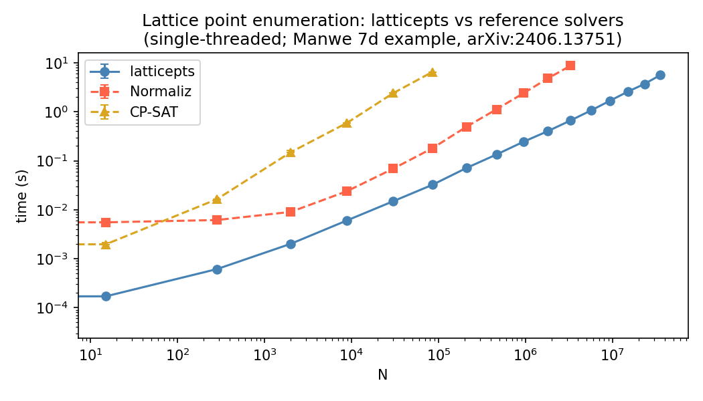

# conevecs
Enumerates lattice points $\\{x\in\mathbb{Z}^{\text{dim}}: Hx\geq\text{rhs}\\}$ for $H\in\mathbb{Z}^{N,\text{dim}}$ and $\text{rhs}\in\mathbb{Z}$. Aims to do so efficiently.

The main use case is for finding lattice points in convex cones, for which $H$ are the inwards-facing hyperplanes. If $\text{rhs}=0$, this will find lattice points in the cone, including its boundary. If $\text{rhs}=1$, then this only finds lattice points in the strict interior of the cone.

Currently, the performance is competitive compared to CP-SAT and Normaliz.


## Limitations

- Maximum dimension: 256 (returns an error if `dim > 256`)
- Windows is not supported: the C kernel uses C99 variable-length arrays, which MSVC does not support

## Installation

```
pip install -e .
```

Requires a C compiler and Cython. NumPy must be installed first.

## Algorithm Notes

This repo contains a Cython wrapper of a C implementation of [Kannan's algorithm](https://doi.org/10.1287/moor.12.3.415). See [this webpage](https://cseweb.ucsd.edu/~daniele/Lattice/Enum.html) for some other relevant work. The core algorithm enumerates lattice points in square boxes $|x_i|\leq B$ for $B\geq 1$. I.e.,

$$ \\{x\in\mathbb{Z}^{\text{dim}}: Hx\geq\text{rhs} \text{ and } |x|_\infty \leq B\\}. $$

This [core algorithm](https://github.com/natemacfadden/conevecs/blob/main/conevecs/box_enum.h) is $\leq 350$ lines - I encourage you to read it.

A helper method is provided in case the user wants $N$ points but doesn't care about box size. In this case, boxes of increasing sizes are studied until $\geq N$ lattice points are found.

## Usage

The primary interface is `enum_lattice_points`, which handles box sizing automatically:

```python
import numpy as np
from conevecs import enum_lattice_points

H   = np.array([[1, 2], [3, -1]], dtype=np.int32)
rhs = 1

# Find at least 1000 lattice points in {H @ x >= rhs}
pts = enum_lattice_points(H=H, rhs=rhs, min_N_pts=1000)

# Optionally restrict to primitive vectors (GCD = 1)
pts = enum_lattice_points(H=H, rhs=rhs, min_N_pts=1000, primitive=True)
```

For direct control over the box size, `box_enum` enumerates all lattice points in $\\{Hx \geq \text{rhs},\\ |x|_\infty \leq B\\}$:

```python
from conevecs import box_enum

pts, status, N_nodes = box_enum(B=5, H=H, rhs=rhs, max_N_out=10_000)
# status: 0 = success, -1 = dim>256, -2 = hit max_N_out, -3 = hit max_N_nodes
```

## Organization

```
conevecs/
├── conevecs/
│   ├── box_enum.h               # STB-style library for the Kannan enumeration
|   ├── box_enum.pyx             # Cython wrapper
|   └── conevecs.py              # a wrapper for box_enum, increasing box size until N points are found
├── tests/
│   ├── conftest.py                      # shared test helpers (pytest)
│   ├── test_box_enum.py                 # generic tests
│   ├── test_manwe.py                    # tests relating to 'Manwe' https://arxiv.org/abs/2406.13751
│   ├── test_enum_lattice_points.py      # tests for enum_lattice_points
│   ├── benchmark_box_enum.py            # B-dilation benchmark for 'Manwe'
│   ├── benchmark_enum_lattice_points.py # N-scaling benchmark for 'Manwe'
|   └── c/                               # simple C-kernel tests (no Python interface)
├── pyproject.toml
└── setup.py
```
